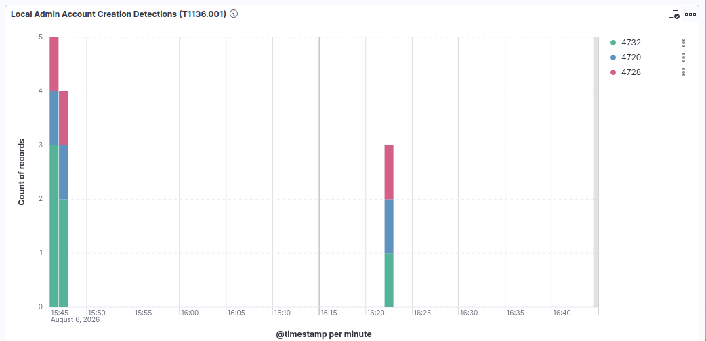
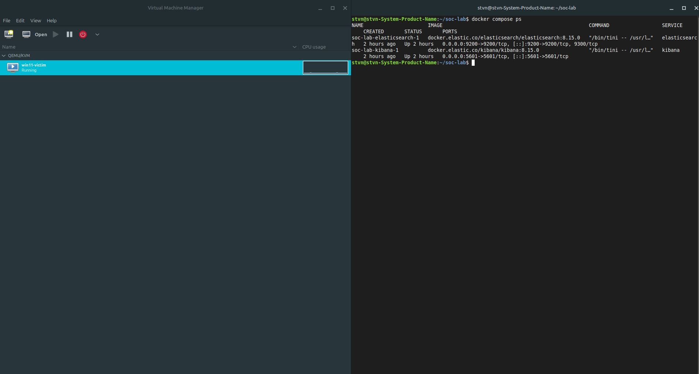
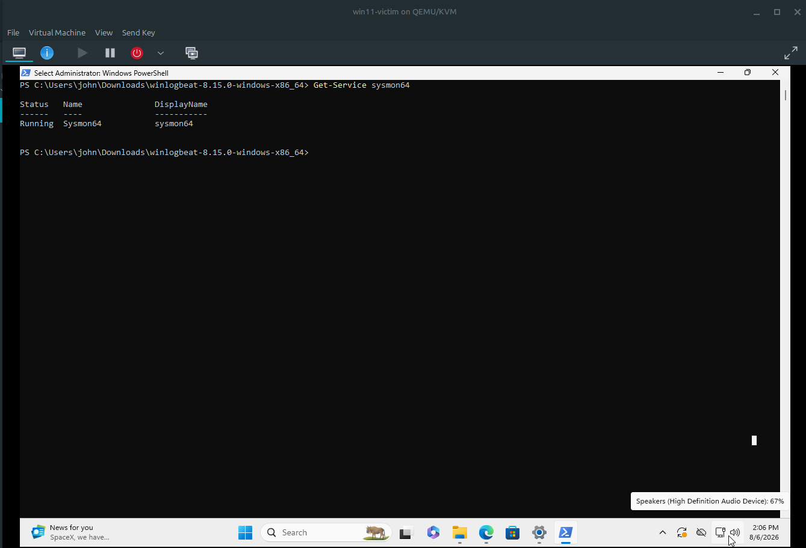
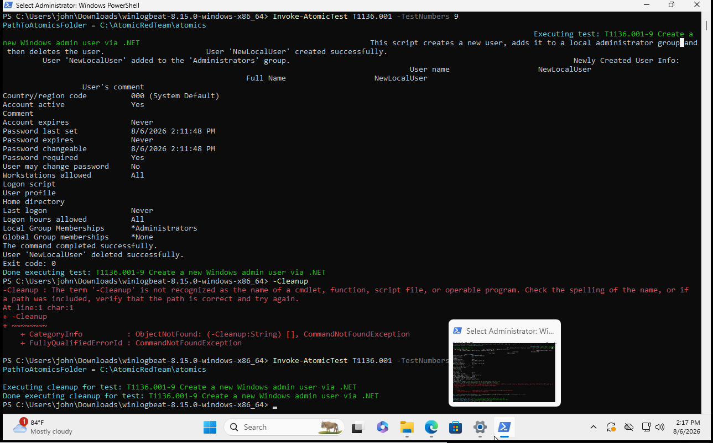
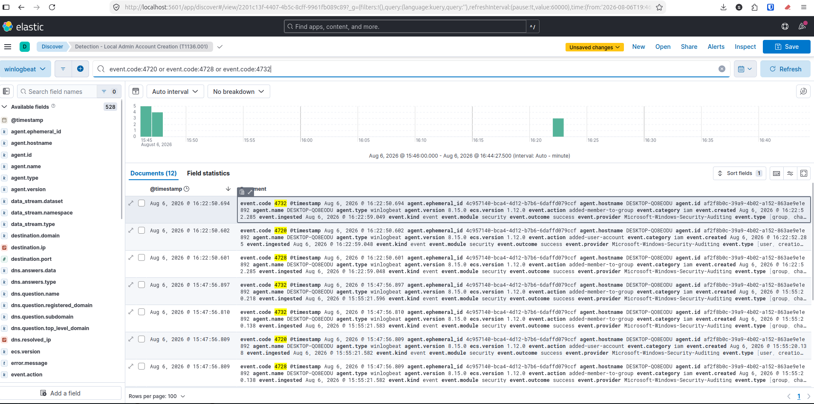

# Lab 01 — Simulate & Detect: Local Privilege Escalation

**Author:** Steven Acosta <br>
**Date:** August 2026 <br>
**Category:** Simulate & Detect <br>
**MITRE ATT&CK technique:** T1136.001, Create Account: Local Account <br>
**Stack:** Linux Mint, QEMU/KVM, Windows 11, Sysmon, Elastic Stack, Atomic Red Team

## Summary

I built a self-hosted SOC lab on Linux Mint, instrumented a Windows 11 endpoint with Sysmon, and shipped its logs into a self-hosted Elastic Stack. Using Atomic Red Team, I simulated a local account creation and privilege escalation into the Administrators group, then located the resulting telemetry in Kibana and built a detection query and dashboard around it.



## Environment

The lab runs on a single machine (Linux Mint, Cinnamon). The SIEM runs directly on this host rather than in a second VM, to keep resource use down.

**Host**
- Linux Mint, 256GB drive
- QEMU/KVM + virt-manager (originally VirtualBox, switched after a kernel module build failure, see Lessons Learned)
- Docker, running the SIEM

**Victim endpoint (VM)**
- Windows 11 Enterprise evaluation, UEFI/Secure Boot, virtual TPM 2.0
- Sysmon with the SwiftOnSecurity configuration
- Winlogbeat forwarding the Security and Sysmon Operational logs to Elasticsearch
- Isolated on a NAT virtual network, no exposure to the home LAN

**SIEM**
- Elasticsearch + Kibana, self-hosted via Docker Compose, single node

**Attack simulation**
- Atomic Red Team, run from an elevated PowerShell session on the victim VM

```
Windows 11 VM (Sysmon + Winlogbeat)
        |
        | Security + Sysmon logs, over the virtual NAT network
        v
Elasticsearch + Kibana (Docker, on the Mint host)
```



## Build process

1. Set up QEMU/KVM as the hypervisor.
2. Built the Windows 11 VM with UEFI, Secure Boot, and a virtual TPM 2.0.
3. Installed Sysmon with the SwiftOnSecurity config.
4. Stood up Elasticsearch and Kibana on the host via Docker Compose.
5. Installed Winlogbeat on the VM, forwarding Security and Sysmon logs to Elasticsearch.
6. Ran an Atomic Red Team test for T1136.001.
7. Found the resulting events in Kibana and built a saved search and dashboard panel.



## Attack simulated

**Technique:** T1136.001, Create Account: Local Account. Attackers use this after gaining initial access, to create a privileged account for persistence without needing domain-level access.

I first tried T1136.002 (domain account creation), which failed since it needs a domain controller to contact and this lab isn't domain-joined. That's expected: a real AD environment is a separate lab on my list.

I then ran T1136.001, test 9 ("Create a new Windows admin user via .NET"), which:
1. Created a local user (`NewLocalUser`) via a PowerShell/.NET script, without `net.exe`
2. Added it to the local Administrators group
3. Removed the account afterward with Atomic Red Team's `-Cleanup` flag



## Detection

I searched Kibana for the Windows Security event IDs tied to account creation and group membership changes:

```
event.code:4720 or event.code:4728 or event.code:4732
```

- **4720** (`added-user-account`): a user account was created
- **4732** (`added-member-to-group`): added to a local security group
- **4728** (`added-member-to-group`): added to a global security group

Every run of the test produces the same three events within about a tenth of a second of each other.



The query returned 12 matching documents total. Two of the account-creation runs are visible in the screenshot above, each showing the identical 4720/4728/4732 pattern about a second apart. I saved the search as `Detection - Local Admin Account Creation (T1136.001)` and built a Lens bar chart of event counts over time, broken down by event code, as a dashboard panel.


## Analysis

The dashboard showed two separate time clusters instead of one. I checked the raw documents in Discover rather than assuming: both clusters carried the same three-event signature, confirming they were separate runs of the same test rather than unrelated account activity.

A query that fires on any account creation event isn't a finished detection on its own. In production this would also catch legitimate provisioning, like new-hire onboarding or IT-created service accounts. It would need more context before going to an analyst as an actionable alert: which account, which host, whether it's inside a known change window, whether the account was used afterward. I confirmed the events tied to the test by matching the `event.action` values and timestamps against when each `Invoke-AtomicTest` command actually ran.

To narrow this for production use, I'd:
- Exclude known built-in accounts (`DefaultAccount`, `WDAGUtilityAccount`) and known change windows
- Correlate with the parent process (Sysmon Event ID 1), since PowerShell invoking .NET account-management APIs is itself worth alerting on
- Add a grouping window, since one account creation is common during normal admin work, but repeated creation across multiple hosts in a short window is a stronger signal

## Lessons learned

- VirtualBox's DKMS module failed to build against the host kernel (a `modpost` error from newer kernel KVM symbol exports). I switched to QEMU/KVM, which uses virtualization support already built into the kernel and has no external module to break.
- Atomic Red Team numbers tests sequentially within a technique file, across all platforms it supports. Test 1 isn't necessarily the Windows one. Requesting a non-Windows test number correctly returns "0 applicable tests," not an error.
- T1136.002 failing on a non-domain-joined host is expected behavior, not a broken environment. Reading a failure correctly matters as much as fixing one.

---

*Screenshots are from the lab session described above, stored in `images/`.*
