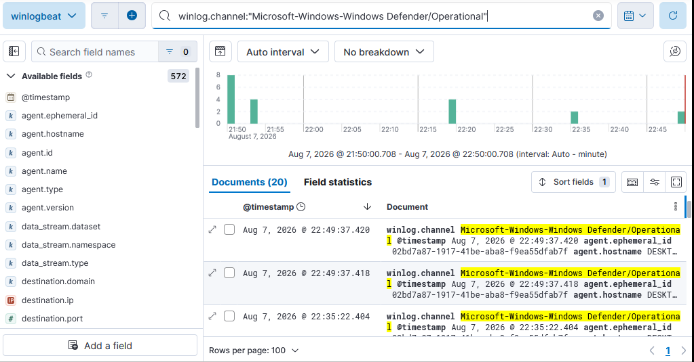
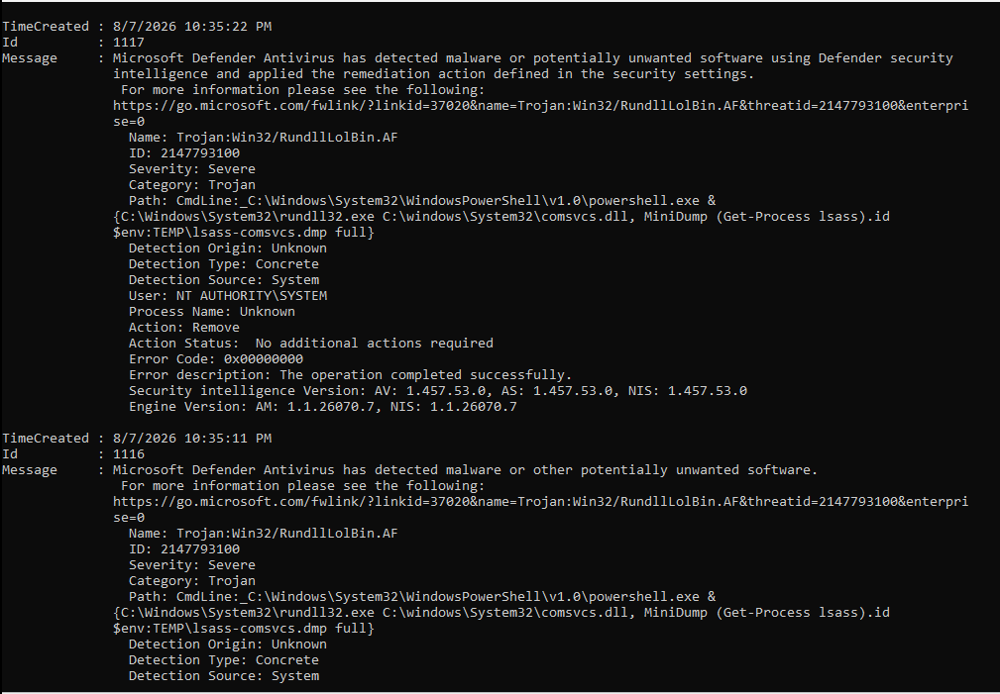
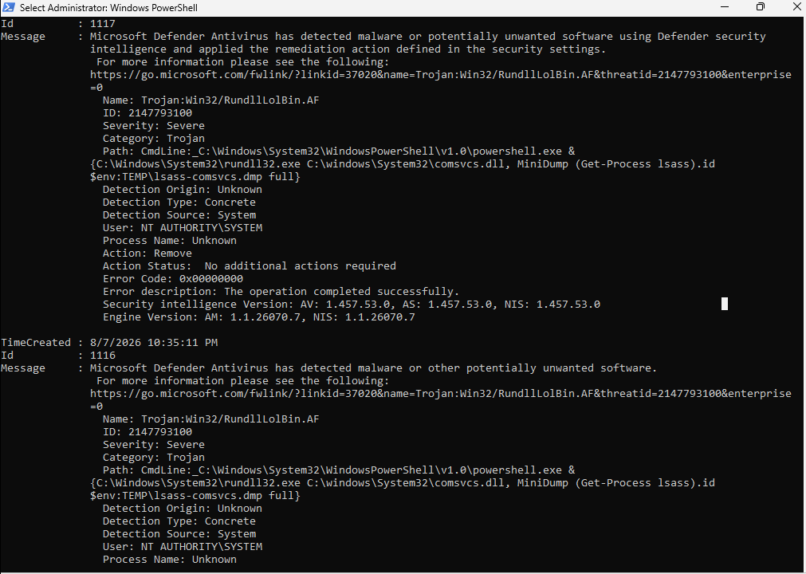
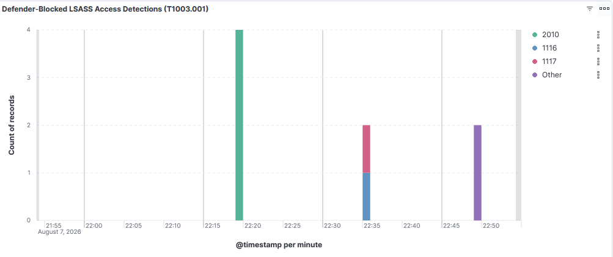

# Lab 02 - Credential Access: LSASS Memory Dumping (Blocked by Defender)

**Author:** Steven Acosta
**Date:** August 2026
**Category:** Simulate & Detect
**MITRE ATT&CK technique:** T1003.001, OS Credential Dumping: LSASS Memory
**Stack:** Linux Mint, QEMU/KVM, Windows 11, Sysmon, Elastic Stack, Windows Defender, Atomic Red Team

## Summary

I tried to simulate LSASS credential dumping in the same lab environment from Lab 01, using Atomic Red Team. Windows Defender's real-time protection blocked both attempts before either one completed. Instead of forcing the technique through, I shipped Defender's own detection log into the SIEM and built the detection around that.



## Environment

Same host, VM, Sysmon install, and Elastic Stack as [Lab 01](../lab01_simulate_detect/README.md#environment). One addition: Winlogbeat now also ships the `Microsoft-Windows-Windows Defender/Operational` log channel to Elasticsearch, alongside Security and Sysmon Operational.

## Build process

1. Added the Defender Operational log channel to `winlogbeat.yml` and restarted the service.
2. Reviewed Atomic Red Team's T1003.001 test list and picked tests that avoided downloading real offensive tooling where possible.
3. Ran the selected tests and checked the results in Windows Defender's own logs.
4. Shipped those logs to Elasticsearch and built a detection query and dashboard around them.

## Attack simulated

**Technique:** T1003.001, OS Credential Dumping: LSASS Memory. Used post-compromise to pull credentials from memory for lateral movement or persistence.

I tried two tests:

- **Test 3** (direct system calls and API unhooking, using the Dumpert tool): Defender quarantined the downloaded executable before it could run (`HackTool:Win64/ATPMiniDump!lsa`).
- **Test 2** (comsvcs.dll MiniDump, a built-in Windows DLL technique with no external download): Defender blocked it behaviorally, flagged the command line itself (`Trojan:Win32/RundllLolBin.AF`), and killed the process before it reached LSASS.



Neither test produced a memory dump. Both produced a Defender detection.

## Detection

The technique never got far enough to generate Sysmon process-access telemetry, so I searched Defender's own operational log instead:

```
winlog.channel:"Microsoft-Windows-Windows Defender/Operational"
```



Four matching events, two per attempted test, each a 1116 (detection) and 1117 (action taken) pair. Each one includes the exact command line Defender caught, the threat name, severity, and remediation action.

I saved the search and built a dashboard panel breaking down event counts by event code.



## Analysis

Both attempts were caught by real-time protection before Sysmon-level telemetry ever came into play, which is defense-in-depth working as intended. This detection is signature and behavior based, so a technique using unknown or heavily obfuscated tooling could still get past it. The Sysmon Event ID 10 rule from Lab 01's config still matters as a second layer for that case.

Treating AV/EDR alert logs as a first-class SIEM input, not just raw host telemetry, is common in production SOC environments, and that's basically what this lab turned into.

## Lessons learned

- Atomic Red Team's external payloads for this technique (Dumpert, Mimikatz, NanoDump) are real, functional offensive tools, not simulations. They get flagged and quarantined by real antivirus, so it's worth checking what a test actually downloads before running it.
- Even living-off-the-land techniques using only built-in Windows binaries, like comsvcs.dll, are signature-detected by modern Defender out of the box. Built-in doesn't mean undetectable.
- When a planned detection approach can't fire because the technique gets blocked upstream, switching to a different but still legitimate telemetry source is a normal engineering decision, not a failed lab.

---

*Screenshots are from the lab session described above, stored in `images/`.*
