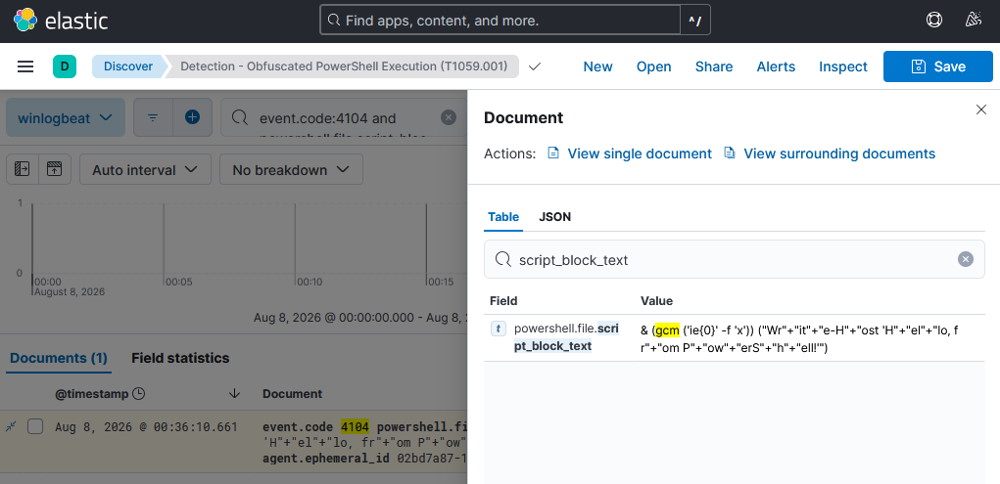
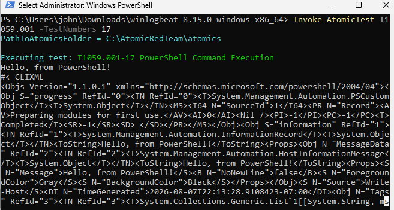
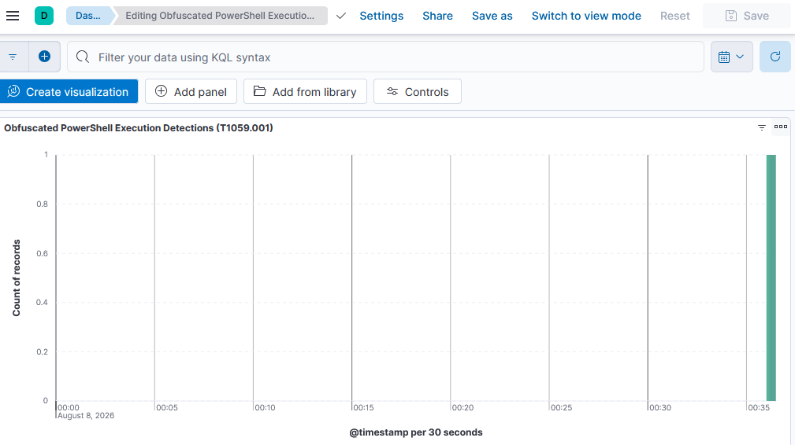

# Lab 03 - PowerShell Living-off-the-Land: Obfuscated Command Execution

**Author:** Steven Acosta <br>
**Date:** August 2026 <br>
**Category:** Simulate & Detect <br>
**MITRE ATT&CK technique:** T1059.001, Command and Scripting Interpreter: PowerShell <br>
**Stack:** Linux Mint, QEMU/KVM, Windows 11, Sysmon, Elastic Stack, Atomic Red Team

## Summary

I ran an obfuscated PowerShell command in the same lab environment from Labs 01 and 02, using Atomic Red Team, and found it in Windows' PowerShell Script Block Logging even though the command was disguised with base64 encoding and string concatenation. The interesting part of this lab wasn't finding the event, it was narrowing a very high-volume log down to the one entry that actually mattered.



## Environment

Same host, VM, Sysmon install, and Elastic Stack as [Lab 01](../lab01_simulate_detect/README.md#environment) and [Lab 02](../lab02_credential_access/README.md#environment). One addition: PowerShell Script Block Logging and Module Logging, both off by default, turned on via two registry keys. Winlogbeat's own default configuration already included the `Microsoft-Windows-PowerShell/Operational` log channel, so no config changes were needed there this time.

## Build process

1. Enabled Script Block Logging and Module Logging under `HKLM:\SOFTWARE\Policies\Microsoft\Windows\PowerShell` via registry keys, which only take effect in new PowerShell sessions.
2. Confirmed the logging pipeline worked end to end with a harmless test command before running anything from Atomic Red Team.
3. Reviewed Atomic Red Team's T1059.001 test list and picked a self-contained test with no external downloads and no real offensive tooling.
4. Ran the test and searched Windows' PowerShell operational log for the result.

## Attack simulated

**Technique:** T1059.001, Command and Scripting Interpreter: PowerShell. Covers using PowerShell itself, already installed on every Windows machine, to run commands rather than bringing in separate malicious software.

I ran test 17, "PowerShell Command Execution," a documented example from Red Canary's 2021 Threat Detection Report. It runs `powershell.exe -e <base64>`, where the base64 decodes to a command built from string fragments and a dynamically resolved cmdlet name rather than being written plainly.



## Detection

A plain search for `event.code:4104` (script block logging) returned 288 documents over a two-day window, almost all of it routine PowerShell activity unrelated to the test: module loading, profile scripts, internal bookkeeping. Narrowing the time range down to the minute the test ran still left three separate script block events from that one command:

- `$global:?`, an internal PowerShell state check, unrelated noise.
- `Write-Host 'Hello, from PowerShell!'`, the fully resolved final content.
- `& (gcm ('ie{0}' -f 'x')) ("Wr"+"it"+"e-H"+"ost 'H"+"el"+"lo, fr"+"om P"+"ow"+"erS"+"h"+"ell!'")`, the command as it actually ran: building the word "iex" through a format string and building the rest through string concatenation.

That third one is the real evidence. Windows had already stripped away the base64 layer and logged the plain text underneath, string-splitting tricks and all.

I built a narrowed query around the specific obfuscation marker this test used:

```
event.code:4104 and powershell.file.script_block_text:*gcm*
```

Saved the search and built a dashboard panel off it.



## Analysis

Script Block Logging captures what actually executes, no matter how many layers of disguise sit on top of it. That's the whole value of this log source. But the raw volume makes it a different kind of detection problem than Labs 01 and 02: there, a specific event ID or a named alert was enough on its own. Here, the event fires constantly during completely normal PowerShell use, so matching on its presence isn't a detection, it's just noise. Anything usable has to filter on content.

The `gcm` marker used here only catches this one specific obfuscation trick. A real detection rule would need several markers together, base64 patterns, string concatenation, dynamic command resolution, `Invoke-Expression` usage, and would need tuning against legitimate admin scripts that sometimes use similar constructs for entirely ordinary reasons.

## Lessons learned

- Check an existing Winlogbeat config before assuming a new log source needs to be added. The PowerShell operational channel was already there from the default setup in Lab 01.
- Script Block Logging and Module Logging are off by default and only apply to PowerShell sessions opened after the registry keys are set, not the current one.
- A single command can generate more than one script block event. Finding the real one sometimes means checking several, not just the first result.
- High-volume logs need content filtering, not just event-ID filtering, to be useful as a detection.

---

*Screenshots are from the lab session described above, stored in `images/`.*
